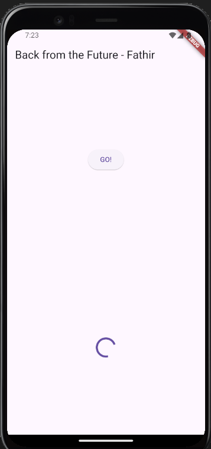
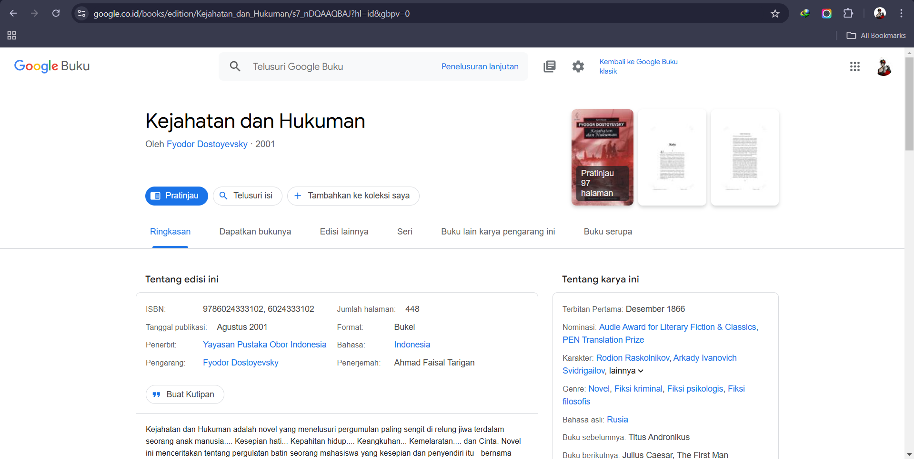
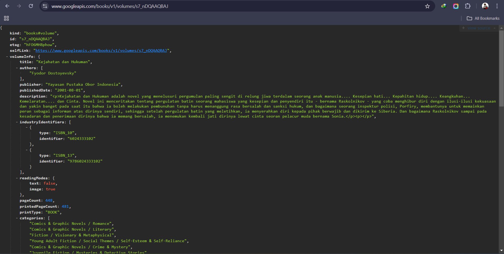
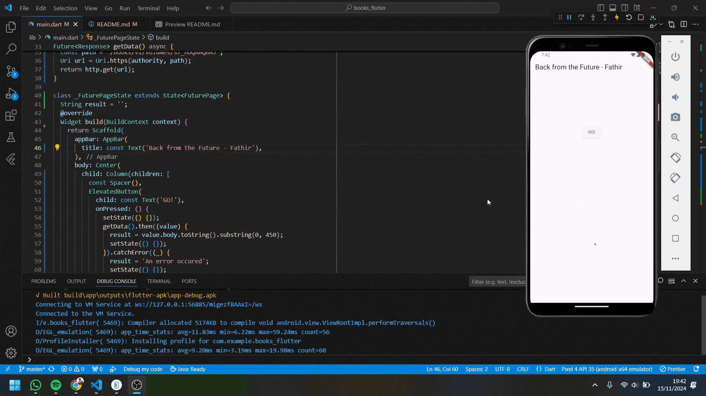
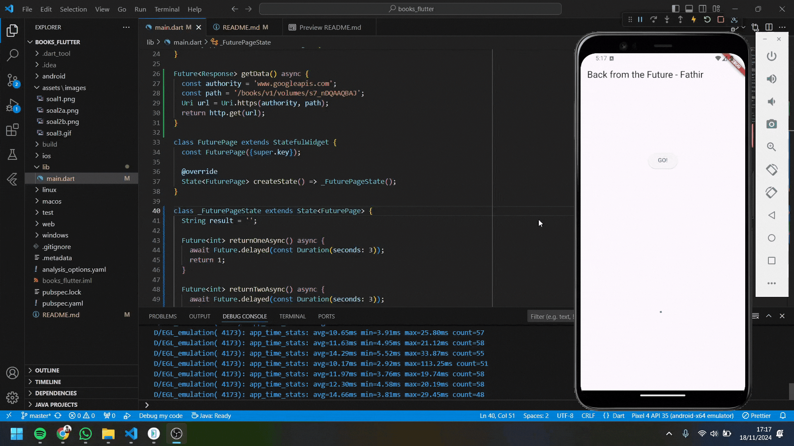

Nama    : Ahmed Fathir Syafaat

Kelas   : TI - 3H

NIM     : 2241720083

# #11 | Pemrograman Asynchronous

## Praktikum 1: Dasar State dengan Model-View
### Soal 1


### Soal 2




### Soal 3
Jelaskan maksud kode langkah 5 tersebut terkait substring dan catchError!
- substring
```
result = value.body.toString().substring(0, 450);
```
> - value.body: Merupakan isi dari respons HTTP yang diterima dari API. 
> - toString(): Memastikan bahwa data tersebut dalam bentuk string meskipun value.body sudah string.
> - substring(0, 450): Fungsi ini mengambil potongan teks dari karakter ke-0 hingga ke-449 dari string respons. Membatasi panjang string untuk ditampilkan di aplikasi agar tidak terlalu panjang, karena respons API biasanya besar.

- catchError
```
.catchError((_) {
    result = 'An error occured';
    setState(() {});
});
```
> Digunakan untuk menangani kesalahan yang terjadi saat menjalankan fungsi asinkron. Misalnya: Tidak ada koneksi internet, URL salah, dan Respons gagal dari server.

Capture hasil praktikum Anda berupa GIF dan lampirkan di README.


## Praktikum 2: Menggunakan await/async untuk menghindari callbacks


### Soal 4
Jelaskan maksud kode langkah 1 dan 2 tersebut!
> - Langkah 1: Membuat tiga fungsi asynchronous (returnOneAsync, returnTwoAsync, returnThreeAsync) yang masing-masing mengembalikan nilai setelah penundaan 3 detik, mensimulasikan operasi lambat.
> - Langkah 2: Membuat fungsi count() untuk menjalankan ketiga fungsi tersebut secara berurutan menggunakan await, menjumlahkan hasilnya, dan memperbarui tampilan dengan hasil total.