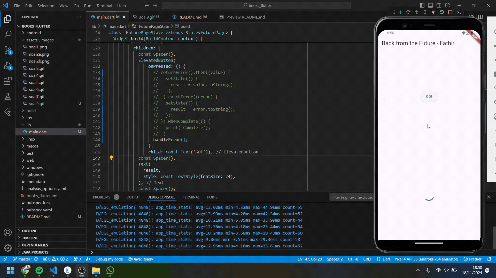
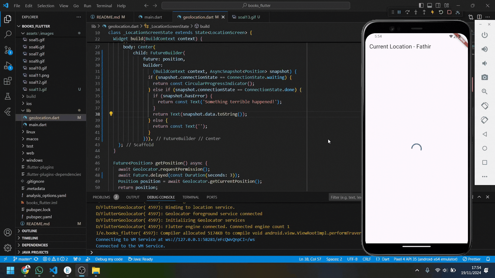

Nama    : Ahmed Fathir Syafaat

Kelas   : TI - 3H

NIM     : 2241720083

# #11 | Pemrograman Asynchronous

## Praktikum 1: Dasar State dengan Model-View
### Soal 1


### Soal 2


### Soal 3
Jelaskan maksud kode langkah 5 tersebut terkait substring dan catchError!
- substring
```
result = value.body.toString().substring(0, 450);
```
> - value.body: Merupakan isi dari respons HTTP yang diterima dari API. 
> - toString(): Memastikan bahwa data tersebut dalam bentuk string meskipun value.body sudah string.
> - substring(0, 450): Fungsi ini mengambil potongan teks dari karakter ke-0 hingga ke-449 dari string respons. Membatasi panjang string untuk ditampilkan di aplikasi agar tidak terlalu panjang, karena respons API biasanya besar.

- catchError
```
.catchError((_) {
    result = 'An error occured';
    setState(() {});
});
```
> Digunakan untuk menangani kesalahan yang terjadi saat menjalankan fungsi asinkron. Misalnya: Tidak ada koneksi internet, URL salah, dan Respons gagal dari server.

Capture hasil praktikum Anda berupa GIF dan lampirkan di README.


## Praktikum 2: Menggunakan await/async untuk menghindari callbacks

### Soal 4
Jelaskan maksud kode langkah 1 dan 2 tersebut!
> - Langkah 1: Membuat tiga fungsi asynchronous (returnOneAsync, returnTwoAsync, returnThreeAsync) yang masing-masing mengembalikan nilai setelah penundaan 3 detik, mensimulasikan operasi lambat.
> - Langkah 2: Membuat fungsi count() untuk menjalankan ketiga fungsi tersebut secara berurutan menggunakan await, menjumlahkan hasilnya, dan memperbarui tampilan dengan hasil total.

Capture hasil praktikum Anda berupa GIF dan lampirkan di README. 


## Praktikum 3: Menggunakan Completer di Future

### Soal 5
Jelaskan maksud kode langkah 2 tersebut!
> Menggunakan Completer untuk membuat Future yang dapat diselesaikan secara manual. Fungsi getNumber() memulai proses perhitungan melalui calculate(), yang menyelesaikan Future setelah 5 detik dengan nilai 42.

Capture hasil praktikum Anda berupa GIF dan lampirkan di README.


### Soal 6
Jelaskan maksud perbedaan kode langkah 2 dengan langkah 5-6 tersebut!
> Langkah 2 hanya menyelesaikan Future dengan nilai tanpa penanganan error, sedangkan langkah 5 menambahkan penanganan error pada calculate() menggunakan try-catch, sehingga Future bisa diselesaikan dengan nilai atau error. Langkah 6 menangani hasil atau error dari getNumber() di UI dengan then untuk sukses dan catchError untuk error.

Capture hasil praktikum Anda berupa GIF dan lampirkan di README.


## Praktikum 4: Memanggil Future secara paralel

### Soal 7
Capture hasil praktikum Anda berupa GIF dan lampirkan di README.


### Soal 8
Jelaskan maksud perbedaan kode langkah 1 dan 4!
> Langkah 1 menggunakan FutureGroup untuk mengelola beberapa Future dengan menambahkannya satu per satu dan menutup grup secara manual sebelum menunggu hasilnya. Langkah 4 mengganti ini dengan Future.wait yang langsung menunggu daftar Future selesai secara paralel tanpa perlu pengelolaan manual.

## Praktikum 5: Menangani Respon Error pada Async Code

### Soal 9
Capture hasil praktikum Anda berupa GIF dan lampirkan di README.


### Soal 10
Panggil method handleError() tersebut di ElevatedButton, lalu run. Apa hasilnya? Jelaskan perbedaan kode langkah 1 dan 4!


> Saat menjalankan handleError(), aplikasi menampilkan pesan error setelah penundaan 2 detik dan mencetak "Complete" di konsol. Perbedaan antara langkah 1 dan langkah 4 adalah bahwa returnError() hanya melempar error tanpa penanganan di dalamnya, sedangkan handleError() menangani error dengan blok try-catch, memperbarui UI dengan pesan error, dan memastikan blok finally dieksekusi untuk mencetak "Complete" di terminal.

## Praktikum 6: Menggunakan Future dengan StatefulWidget

## Soal 11
Tambahkan nama panggilan Anda pada tiap properti title sebagai identitas pekerjaan Anda.


## Soal 12
Apakah Anda mendapatkan koordinat GPS ketika run di browser? Mengapa demikian?
> Tidak, koordinat GPS tidak akan muncul saat dijalankan di browser karena paket geolocator lebih cocok untuk platform mobile seperti Android dan iOS. Browser membutuhkan izin melalui API geolokasi bawaan (navigator.geolocation) yang tidak sepenuhnya didukung oleh geolocator tanpa konfigurasi tambahan.

Capture hasil praktikum Anda berupa GIF dan lampirkan di README.


## Praktikum 7: Manajemen Future dengan FutureBuilder

### Soal 13
Apakah ada perbedaan UI dengan praktikum sebelumnya? Mengapa demikian?
> FutureBuilder memberikan cara deklaratif untuk menangani data asinkron, sedangkan setState memerlukan pengelolaan manual. Hal inilah yang membuat tampilan dan logika asinkron lebih terintegrasi di praktikum ini.

Capture hasil praktikum Anda berupa GIF dan lampirkan di README.


### Soal 14
Apakah ada perbedaan UI dengan langkah sebelumnya? Mengapa demikian?
> UI pada langkah ini menampilkan pesan "Something terrible happened!" jika terjadi error, sedangkan sebelumnya tidak ada penanganan error, sehingga UI akan kosong jika masalah muncul.

Capture hasil praktikum Anda berupa GIF dan lampirkan di README.


## Praktikum 8: Navigation route dengan Future Function

### Soal 15
Tambahkan nama panggilan Anda pada tiap properti title sebagai identitas pekerjaan Anda.


### Soal 16
Cobalah klik setiap button, apa yang terjadi ? Mengapa demikian ?
> Ketika tombol diklik, layar kembali ke Navigation First Screen dengan warna latar berubah sesuai tombol yang dipilih, karena nilai warna dikembalikan melalui Navigator.pop dan diperbarui dengan setState.

Capture hasil praktikum Anda berupa GIF dan lampirkan di README. 


